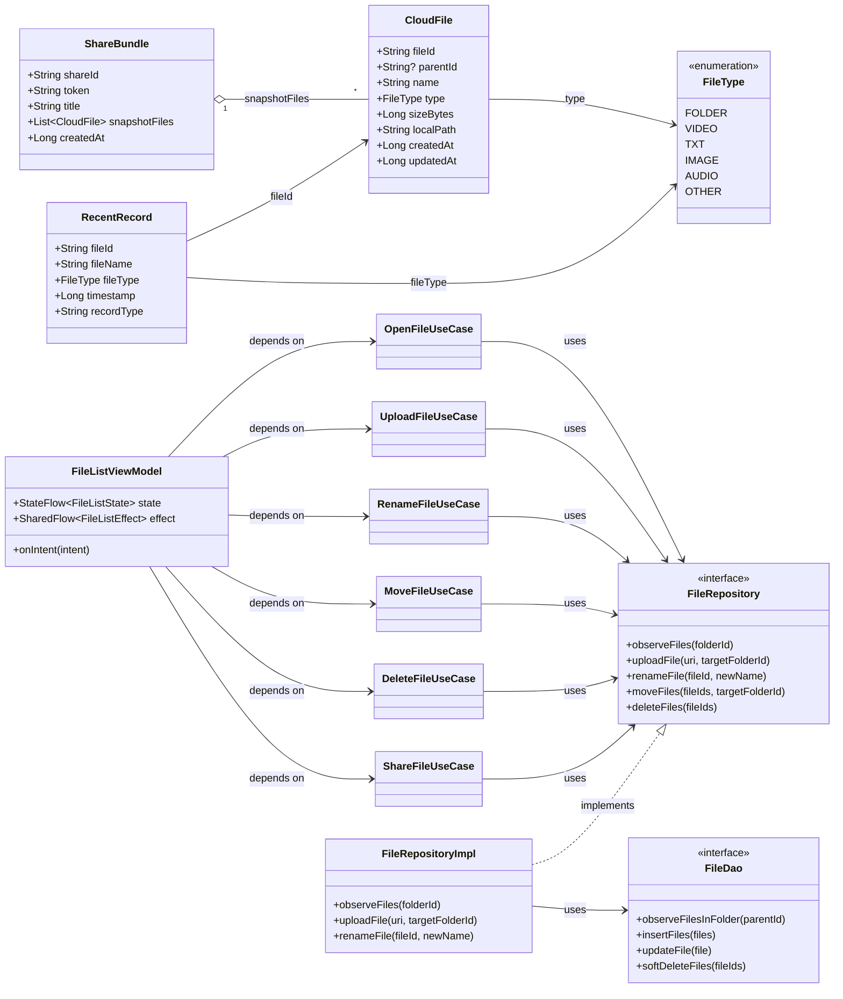
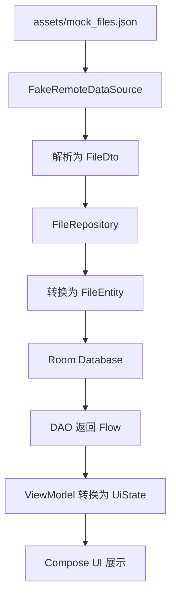
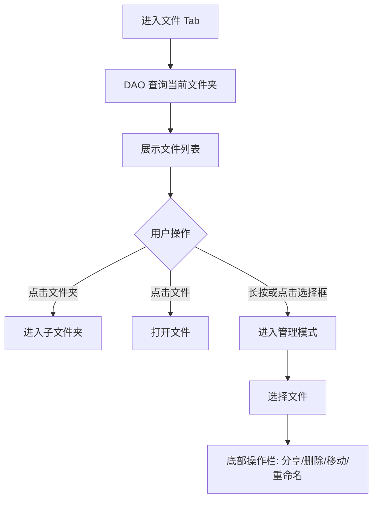
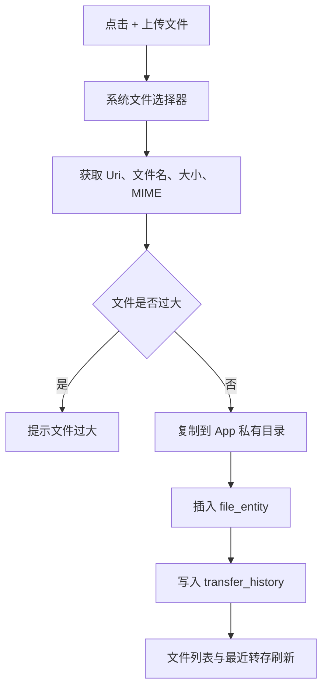
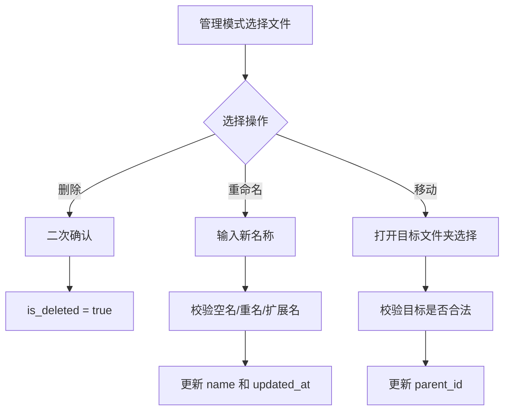
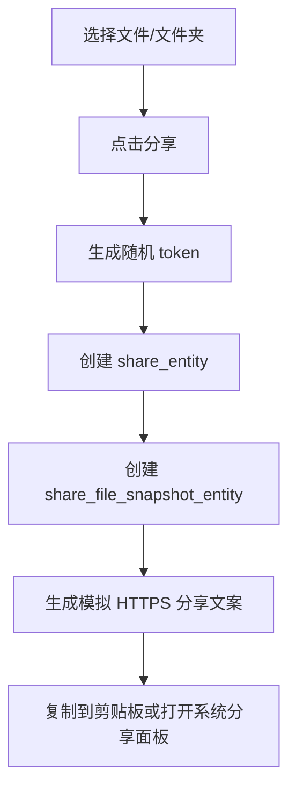
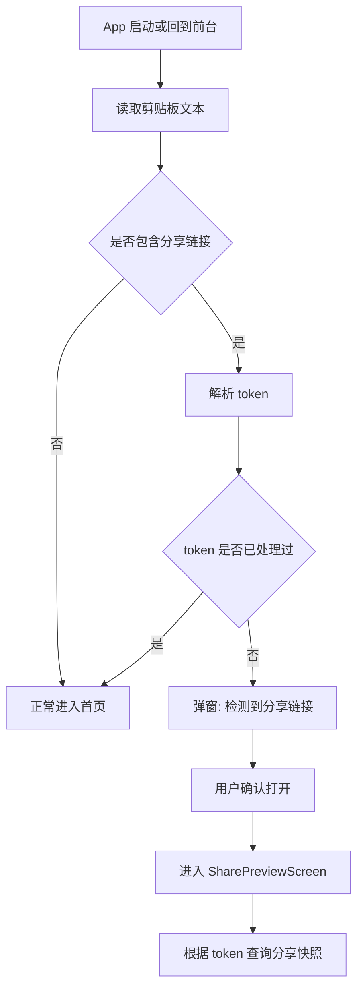
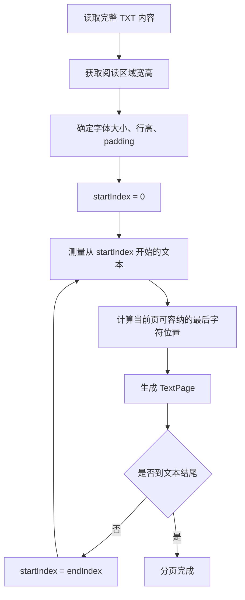
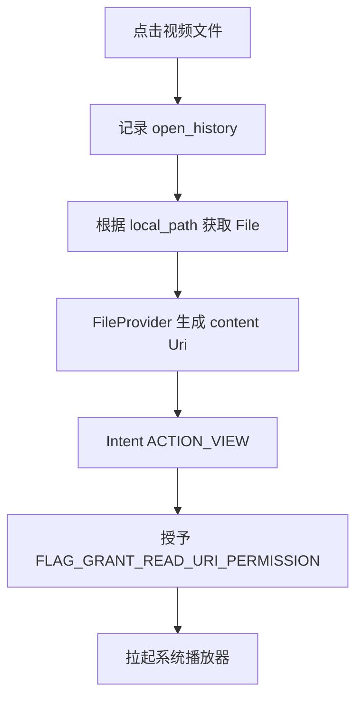
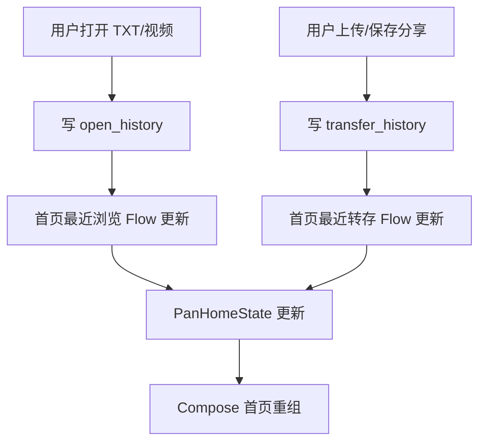

# 第 1 章 项目定位与评分锚点

## 1.1 项目定位

**为什么这样定位：** 这个项目的本质不是复刻一个完整商业网盘，而是在三周内用一个可运行的 Android 客户端证明：我理解移动端 UI、状态管理、本地数据库、文件访问、异步数据流、DeepLink、异常处理和工程组织。老师演示里出现了文件管理态、重命名、移动、分享面板、复制成功、聊天窗口中的 HTTPS 分享链接、复制链接后打开 App、分享页加载与文件列表展示，这些都说明验收重点不是“页面长得像”，而是核心链路是否能跑通、设计是否有解释力。

项目目标定义为：

> 基于 Android Kotlin + Jetpack Compose + Room + Hilt + Coroutines/Flow + MVI 的简易个人网盘客户端，支持文件树管理、本地上传、最近浏览、最近转存、TXT 分页阅读、系统视频播放、文件分享、模拟 HTTPS 分享链接、剪贴板识别拉起分享页，并在时间充裕时增加轻量服务端实现。

最终我需要交付的不只是 APK，而是一个可以被追问的工程：每个关键选择都能回答“为什么这么做”“代价是什么”“有没有替代方案”“三周内是怎么迭代优化的”。因此，本开发指南优先服务于开发过程中的技术决策、质量控制和迭代记录，而不是三周后直接提交给老师的交付文档。

## 1.2 评分锚点与拿分动作

**为什么先重排评分锚点：** 评分中“技术实现理解”占 40%，比“功能完备性”更高。如果只堆功能，很容易做出一个能跑但讲不清楚的 App。老师又明确强调想看思考过程、迭代成长和底层原理，所以开发过程必须围绕“可解释性”组织。每个功能都要留下决策痕迹、代码注释、日志、测试和可复盘材料。

| 评分维度 | 权重 | 我的拿分动作 |
|---|---:|---|
| 技术实现理解 | 40% | 建立 `docs/DECISIONS.md`，目标记录 15-25 条关键决策；核心模块保留必要注释；准备 MVI、Room、Flow、FileProvider、TXT 分页、剪贴板安全模型的答辩话术；关键算法写单元测试；对 v1/v2 迭代做对比说明。 |
| 功能完备性 | 30% | 优先完成网盘首页、文件列表、文件夹进入、视频打开、TXT 阅读器、上传、删除、移动、重命名、分享、剪贴板识别分享链接、分享页保存、最近浏览和最近转存。所有功能围绕一条 3-5 分钟演示主路径闭环。 |
| 用户体验优化 | 15% | 每个核心功能必须处理 loading、empty、error 三类状态；上传过大文件、文件不存在、重名、移动到自身子目录、剪贴板链接无效、无播放器、TXT 编码失败等场景要有明确 UI 反馈；文件列表使用稳定 key 并用简单性能观察验证滑动流畅度。 |
| 文档与表达 | 10% | 本指南用于开发；最终交付文档从这里提炼。三周后输出 README、实现方案、UML、流程图、TXT 分页说明、DeepLink 说明、测试用例和录屏脚本。文档不写空话，必须对应真实代码和真实决策。 |
| 进阶挑战 | 5% | 明确做 MVI 架构和轻量服务端。服务端只作为前 6 阶段完成后的加分项，不反向拖累客户端主线。拓展项 2 广告 SDK 不做，原因是 SDK 接入审核耗时、体积大、ROI 低。 |

## 1.3 核心范围与降级策略

**为什么需要降级策略：** 三周项目最危险的不是功能少，而是范围失控导致主链路不稳定。我的优势是后端经验，劣势是客户端经验不足，所以必须把时间投入到客户端基础能力和技术解释力上。所有“看起来高级但会拖慢主线”的功能都要后置。

核心必做范围：

1. 网盘 Tab：个人信息、空间信息、最近转存、最近浏览。
2. 文件 Tab：文件夹、视频、TXT 文档，支持进入文件夹、筛选、排序、管理态。
3. 文件管理：上传、删除、移动、重命名。
4. 分享链路：单文件、文件夹分享；多文件分享作为管理态增强，时间不足时可简化。
5. 分享打开：以“复制 HTTPS 链接后打开 App，剪贴板识别并进入分享页”为主路径。
6. 文件打开：视频用系统播放器；TXT 用自研分页阅读器。
7. 数据要求：mock JSON → Repository → Room → 数据结构 → Compose UI。

明确降级范围：

- 不做 KMP。虽然拓展项写了 KMP + MVI，但 KMP 对当前时间和经验成本过高，容易影响主线。保留 MVI 作为架构亮点。
- 不做广告 SDK。只在最终文档说明原因。
- 不做自定义视频播放器。系统播放器已经满足必做项。
- 服务端只做轻量接口，不做真实云存储，不做跨设备真实文件转存。
- 图片、音频、更多文件类型只做展示和筛选，不作为核心打开能力。

## 1.4 演示主路径

**为什么要先定义演示主路径：** 评分时评委看到的是一个有限时间内的操作录屏。主路径决定开发优先级，也决定测试用例怎么写。所有模块都要服务于这条路径，避免出现“功能都有一点，但录屏无法流畅串起来”的问题。

建议最终 3-5 分钟演示路径：

```text
启动 App
→ 网盘 Tab 展示个人信息、最近浏览、最近转存
→ 切到文件 Tab
→ 进入一个文件夹
→ 打开 TXT，展示分页，左滑上一页、右滑下一页
→ 返回文件列表，打开视频，拉起系统播放器
→ 回到网盘 Tab，最近浏览出现刚打开的文件
→ 上传一个本地 TXT 或小视频，首页最近转存刷新
→ 进入管理态，选择文件，执行重命名
→ 执行移动到另一个文件夹
→ 分享一个文件夹或文件，生成 HTTPS 文案并复制
→ 退出或切到桌面，再打开 App
→ App 识别剪贴板分享链接，进入分享页
→ 点击保存到网盘，最近转存刷新
```

这条路径覆盖必做功能，同时能展示技术理解：Room 响应式更新、MVI 状态流转、FileProvider、TXT 分页、剪贴板识别、分享快照和异常反馈。

# 第 2 章 技术选型与决策（含“为什么”）

## 2.1 技术栈总表

**为什么用表格固化技术栈：** Codex 生成代码时容易随意引入依赖或混用架构，表格可以作为约束。每一项都说明替代方案和放弃原因，后续答辩时也能解释“我不是随便选的”。

| 模块 | 选择 | 为什么选择 | 考虑过的替代方案与放弃原因 |
|---|---|---|---|
| 语言 | Kotlin | Android 现代开发主流语言，协程、Flow、扩展函数和数据类适合表达状态与数据流。 | Java 可行但样板代码多；Swift/iOS 不适合当前 Android Compose 要求。 |
| UI | Jetpack Compose | 项目要求 Android 使用 Compose；声明式 UI 与 MVI 的 State 驱动天然匹配。 | XML View 体系成熟但不符合要求，也不利于展示现代客户端能力。 |
| 架构 | MVI + 分层架构 | 单一 State、显式 Intent、一次性 Effect 便于解释状态变化和迭代过程。 | 纯 MVVM 更简单，但多页面共享状态、管理态、多选、弹窗和导航副作用容易分散。MVI 代价是样板代码更多。 |
| 数据库 | Room | 满足 SQLite 要求；DAO 可返回 Flow；Entity/DAO/Transaction 便于讲清楚数据一致性。 | 直接 SQLite 可控但代码量大；DataStore 不适合文件表和关联查询。 |
| 异步 | Coroutines + Flow | IO、网络模拟、数据库查询都能非阻塞；Flow 可表达连续数据更新。 | Callback 难维护；RxJava 学习成本和依赖成本更高。 |
| 依赖注入 | Hilt | 方便注入 Repository、DAO、DataSource，也方便 Fake/HTTP 数据源切换和单元测试。 | 手写 Service Locator 简单但后期替换和测试不清晰；Koin 轻量但官方生态一致性不如 Hilt。 |
| 导航 | Navigation Compose | 与 Compose 生态一致，便于处理 `file/{id}`、`share/{token}`、`reader/{id}` 等页面路由。 | 手动管理页面状态容易混乱；单 Activity 多 Screen 更适合本项目。 |
| 文件选择 | SAF + Activity Result API | 不需要复杂存储权限，适合选择本地文件并复制到 App 私有目录。 | 直接申请外部存储权限在新 Android 版本限制多，且不利于演示稳定。 |
| 文件共享 | FileProvider | 视频拉起系统播放器需要安全暴露 content Uri，不能直接暴露 file path。 | `file://` 在高版本 Android 会触发权限问题，也不符合安全模型。 |
| 分享打开 | 剪贴板识别为主，App Links 可选 | 项目文字强调“复制链接并打开 App”；剪贴板路径最稳定，模拟 HTTPS 可满足业务形态。 | 纯 App Links 需要真实域名和 assetlinks 验证，未验证时不同系统和应用行为不稳定。 |
| 日志 | Timber | 比直接 `Log.d` 更适合统一开关、Tag 管理和调试；可记录关键状态流转。 | 原生 Log 可用但分散；复杂埋点系统没必要。 |
| 测试 | JUnit + Truth/AssertJ 可选 | 算法和解析器用单元测试证明理解，而不是只靠手测。 | 大规模 UI 测试成本高，三周内只做少量关键路径 UI 手测即可。 |
| 服务端拓展 | 轻量 API | 用后端经验做加分，但不做真实云盘；接口只服务于初始化、分享 token、分享快照。 | 完整文件上传下载服务器会挤占客户端时间，不符合评分主线。 |

## 2.2 为什么选择 MVI 而不是纯 MVVM

**为什么：** 文件列表页有普通模式、管理模式、多选、筛选、排序、弹窗、移动目标选择、分享副作用、视频打开副作用、TXT 跳转副作用；如果用传统 MVVM，很容易出现多个 LiveData/StateFlow 分散维护，某些 UI 状态之间不一致。MVI 把当前页面状态收敛到一个 State，把用户行为收敛成 Intent，把 Toast、导航、系统播放器、系统分享这类一次性动作收敛成 Effect。这样答辩时能沿着“用户行为 → 状态变化 → UI 重组”讲清楚。

MVI 的代价是样板代码更多，初期开发慢一点。但这个项目评分重视技术理解，MVI 的“显式状态机”能帮助我留下更清晰的思考过程。实际实现上不追求复杂框架，只做 lightweight MVI：ViewModel 暴露 `StateFlow<UiState>` 和 `SharedFlow<Effect>`，Composable 只收集状态和发送 Intent。

## 2.3 DeepLink 决策：剪贴板识别为主，App Links 作为可选拓展

**为什么：** 老师演示里有复制分享链接到聊天窗口、再复制链接、打开 App 后进入分享页的路径；项目文字也写了“复制链接并打开 App，可拉起分享的文件列表页”。因此剪贴板识别是最符合验收文字的主路径。模拟 HTTPS 链接可以长得像真实分享链接，但只要没有真实域名、证书、`assetlinks.json` 和系统验证，Android App Links 不一定稳定直接拉起 App。尤其在 Android 12+ 之后，未验证的 HTTPS 链接更可能优先交给浏览器或由系统选择器处理。

所以实现分两层：

1. **主路径：剪贴板识别。** App 启动或回到前台时读取剪贴板，匹配分享链接，解析 token，弹窗确认后进入分享页。
2. **拓展路径：App Links。** 如果服务端阶段完成并具备域名，再配置 `https://domain/s/{token}` 的 Intent Filter 和 `assetlinks.json`。没有真实验证时，只把它作为演示辅助，不把它作为唯一入口。

## 2.4 我必须深挖的 5 个底层原理点

**为什么必须深挖：** 老师已经强调重点看思考过程和底层原理。下面 5 个点刚好覆盖项目最容易被追问的技术核心：UI 性能、异步、数据库响应式更新、跨 App 文件访问、剪贴板安全。每个点不要求变成专家，但要能讲清楚机制、踩坑和我在项目中的应用。

1. **Compose 重组机制。** 我需要理解 State 改变如何触发重组，为什么列表项要使用 stable key，`remember` 保存的是组合生命周期内的值，`derivedStateOf` 适合从已有状态派生计算结果，Snapshot 系统如何感知状态读写。项目中用这些知识解释文件列表筛选、管理态勾选、最近浏览刷新为什么不会全局乱刷新。

2. **协程 + Flow 的取消传播与冷热流。** 我需要理解 `viewModelScope` 随 ViewModel 销毁自动取消，`withContext(Dispatchers.IO)` 切换 IO 线程，`Flow` 默认冷流，`StateFlow` 是热流并保留最新状态，`collectLatest` 在新数据到来时取消旧任务。项目中用它解释数据库流、上传任务、分享页加载和页面退出时任务取消。

3. **Room + InvalidationTracker 的响应式更新。** 我需要理解 DAO 返回 Flow 时，Room 如何在表变化后通知查询重新执行；为什么插入 open_history 后首页最近浏览能自动刷新；为什么需要事务保证文件表和历史表一致。项目中用它解释“json → 数据库 → UI”的响应式链路，而不是手动到处刷新页面。

4. **FileProvider 与 URI 权限模型。** 我需要理解为什么不能把真实文件路径直接给外部播放器，`content://` Uri 如何通过 FileProvider 映射到 App 私有文件，`FLAG_GRANT_READ_URI_PERMISSION` 如何临时授予外部应用读取权限。项目中用它解释视频打开为什么安全、为什么高版本 Android 不推荐 `file://`。

5. **Android 12+ 剪贴板访问安全模型。** 我需要理解剪贴板属于敏感数据，App 不应该后台频繁读取；应只在前台、启动或恢复时读取，并给用户明确确认弹窗。Android 新版本对剪贴板读取有提示和限制，因此实现时要避免循环读取、避免静默消费用户剪贴板，并记录最近处理 token 防止反复弹窗。

# 第 3 章 工程结构与架构设计

## 3.1 分层目录结构

**为什么这样拆目录：** 目录结构的目标不是“看起来复杂”，而是让职责边界清楚。UI 不直接操作 Room 和文件系统，Repository 不关心 Compose，UseCase 承载跨 Repository 的业务，DataSource 负责本地、远端、文件存储细节。这样 Codex 生成代码时不容易把逻辑塞进 Composable，也方便后续把 Fake 数据源换成 HTTP 服务端。

```text
app
├── ui
│   ├── home
│   │   ├── PanHomeScreen.kt
│   │   ├── PanHomeViewModel.kt
│   │   └── PanHomeContract.kt
│   ├── file
│   │   ├── FileListScreen.kt
│   │   ├── FileListViewModel.kt
│   │   └── FileListContract.kt
│   ├── reader
│   │   ├── TxtReaderScreen.kt
│   │   ├── TxtReaderViewModel.kt
│   │   └── TxtPaginator.kt
│   ├── share
│   │   ├── SharePreviewScreen.kt
│   │   ├── SharePreviewViewModel.kt
│   │   └── SharePreviewContract.kt
│   └── component
│       ├── FileItemRow.kt
│       ├── EmptyState.kt
│       ├── RenameDialog.kt
│       └── MoveTargetBottomSheet.kt
│
├── domain
│   ├── model
│   │   ├── CloudFile.kt
│   │   ├── FileType.kt
│   │   ├── ShareBundle.kt
│   │   └── RecentRecord.kt
│   ├── repository
│   │   ├── FileRepository.kt
│   │   ├── ShareRepository.kt
│   │   └── RecentRepository.kt
│   └── usecase
│       ├── OpenFileUseCase.kt
│       ├── UploadFileUseCase.kt
│       ├── ShareFileUseCase.kt
│       ├── SaveSharedFilesUseCase.kt
│       ├── RenameFileUseCase.kt
│       ├── MoveFileUseCase.kt
│       └── DeleteFileUseCase.kt
│
├── data
│   ├── local
│   │   ├── AppDatabase.kt
│   │   ├── dao
│   │   ├── entity
│   │   └── mapper
│   ├── remote
│   │   ├── FakeRemoteDataSource.kt
│   │   ├── HttpRemoteDataSource.kt
│   │   └── dto
│   ├── storage
│   │   ├── LocalFileStorage.kt
│   │   └── FileUriProvider.kt
│   └── repository
│       ├── FileRepositoryImpl.kt
│       ├── ShareRepositoryImpl.kt
│       └── RecentRepositoryImpl.kt
│
├── di
│   ├── DatabaseModule.kt
│   ├── RepositoryModule.kt
│   └── DispatcherModule.kt
│
├── deeplink
│   ├── DeepLinkParser.kt
│   ├── ClipboardLinkObserver.kt
│   └── ShareLinkBuilder.kt
│
├── navigation
│   ├── AppNavGraph.kt
│   └── Routes.kt
│
└── util
    ├── FileSizeFormatter.kt
    ├── TimeFormatter.kt
    └── Logger.kt
```

## 3.2 Hilt 依赖注入

**为什么引入 Hilt：** 没有依赖注入时，ViewModel 很容易直接 new Repository，Repository 又直接 new DAO 或 DataSource，测试和替换都会困难。Hilt 让依赖图显式化：DAO、Repository、UseCase、Dispatcher 都由模块提供。后续如果增加服务端，只需要把 `FakeRemoteDataSource` 切换为 `HttpRemoteDataSource`，而不是改 UI 和 ViewModel。

这段代码体现的设计意图：把数据库、DAO 和 Repository 的构造统一交给 Hilt，避免业务代码手动创建依赖。

```kotlin
@Module
@InstallIn(SingletonComponent::class)
object DatabaseModule {
    @Provides
    @Singleton
    fun provideDatabase(@ApplicationContext context: Context): AppDatabase {
        return Room.databaseBuilder(
            context,
            AppDatabase::class.java,
            "simple_pan.db"
        ).build()
    }

    @Provides
    fun provideFileDao(database: AppDatabase): FileDao = database.fileDao()
}

@Module
@InstallIn(SingletonComponent::class)
abstract class RepositoryModule {
    @Binds
    abstract fun bindFileRepository(
        impl: FileRepositoryImpl
    ): FileRepository
}
```

## 3.3 Timber 日志与可观测性

**为什么需要日志框架：** 三周项目要体现迭代和问题定位，日志不是可有可无。上传失败、DeepLink 解析失败、剪贴板重复弹窗、分页耗时、数据库初始化都需要可观察。Timber 比散落的 `Log.d` 更统一，Debug 包可以打印详细日志，Release 包可以降低输出。日志也能服务于决策日志：记录问题发生的位置，复盘为什么要优化。

这段代码体现的设计意图：在 Application 初始化日志树，在关键业务点记录状态变化而不是只在 UI 打 Toast。

```kotlin
@HiltAndroidApp
class SimplePanApp : Application() {
    override fun onCreate() {
        super.onCreate()
        if (BuildConfig.DEBUG) {
            Timber.plant(Timber.DebugTree())
        }
    }
}

class DeepLinkParser {
    fun parse(text: String): ShareLink? {
        Timber.d("Parsing share link from clipboard text length=%d", text.length)
        // 解析逻辑省略
        return null
    }
}
```

## 3.4 MVI 合同：State / Intent / Effect 的边界

**为什么要明确边界：** MVI 最大价值是状态边界清楚。State 是“当前 UI 长什么样”，必须可持久、可重放；Intent 是“用户做了什么”，由 UI 发送给 ViewModel；Effect 是“一次性动作”，例如 Toast、导航、打开系统播放器、打开系统分享面板。把三者混在一起会导致重复导航、状态丢失或重组后重复 Toast。

这段代码体现的设计意图：文件列表页所有 UI 状态收敛到一个 State，用户操作收敛为 Intent，跨系统动作通过 Effect 发出。

```kotlin
data class FileListState(
    val currentFolderId: String = ROOT_FOLDER_ID,
    val files: List<CloudFileUiModel> = emptyList(),
    val selectedFileIds: Set<String> = emptySet(),
    val isManaging: Boolean = false,
    val isLoading: Boolean = false,
    val filter: FileFilter = FileFilter.All,
    val sortType: SortType = SortType.Comprehensive,
    val errorMessage: String? = null
)

sealed interface FileListIntent {
    data class EnterFolder(val folderId: String) : FileListIntent
    data class OpenFile(val fileId: String) : FileListIntent
    data class ToggleSelect(val fileId: String) : FileListIntent
    data object SelectAll : FileListIntent
    data class RenameFile(val fileId: String, val newName: String) : FileListIntent
    data class MoveFiles(val fileIds: List<String>, val targetFolderId: String) : FileListIntent
    data class DeleteFiles(val fileIds: List<String>) : FileListIntent
    data class ShareFiles(val fileIds: List<String>) : FileListIntent
}

sealed interface FileListEffect {
    data class NavigateToTxtReader(val fileId: String) : FileListEffect
    data class OpenVideoBySystem(val uri: Uri, val mimeType: String) : FileListEffect
    data class ShowToast(val message: String) : FileListEffect
    data class CopyShareText(val text: String) : FileListEffect
}
```

## 3.5 核心模块单元测试计划

**为什么要写单元测试：** 项目不是测试工程，但关键纯逻辑模块必须有测试，才能证明我不仅“让页面跑起来”，也理解业务规则。单元测试不追求覆盖率数字，而是覆盖最容易被追问的算法和规则：TXT 分页、移动文件校验、DeepLink 解析。

最低测试计划：

| 模块 | 测试目标 | 典型用例 |
|---|---|---|
| `TxtPaginator` | 分页边界正确 | 空文本、短文本、含换行文本、最后一页不足一页、页码越界 |
| `MoveFileUseCase` / `MoveValidator` | 防止非法移动 | 文件夹不能移动到自身、不能移动到子目录、目标文件夹不存在、同目录移动无效 |
| `DeepLinkParser` | 链接解析稳定 | 合法 HTTPS 链接、带 query 的链接、聊天文案中的链接、非法链接、重复 token |
| `ShareLinkBuilder` | 链接不泄露明文 | 生成链接不包含 file_id、path、local_path |
| `FileTypeDetector` | 文件类型识别 | `.txt`、`.mp4`、`.jpg`、未知扩展名、无扩展名 |

## 3.6 核心域模型 UML 类图

**为什么补充类图：** flowchart 更适合描述“一个业务动作如何流转”，例如上传、分享、DeepLink 打开；classDiagram 更适合描述“系统里有哪些核心对象、对象之间怎么依赖”。需求明确要求 UML 类图，所以这里用类图把静态结构和依赖方向固化下来。类图的价值不在于把所有类都画全，而是让评委和我自己一眼看出：UI 层依赖 UseCase，UseCase 依赖 Repository 接口，RepositoryImpl 在 data 层再依赖 DAO；UI 层不知道 Room 的存在，这体现依赖倒置和分层边界。



读图要点：第一，箭头方向表达依赖方向，`FileListViewModel` 只知道 UseCase，不直接知道 DAO。第二，`FileRepository` 是 domain 层接口，`FileRepositoryImpl` 在 data 层实现它，这是依赖倒置原则的体现。第三，`ShareBundle` 聚合的是分享快照文件，而不是直接暴露原始数据库路径或外部链接参数，这和“分享链接不包含明文文件信息”的需求一致。

# 第 4 章 数据库设计与数据流

## 4.1 数据库总体设计

**为什么采用本地数据库优先：** 项目要求上传功能中使用数据库，并强调 json → 数据库 → 数据结构。本地 Room 是客户端能力的核心证明：它能支撑文件树、历史记录、分享快照、最近转存和响应式 UI。即使后续增加服务端，Room 仍然作为本地缓存和单一数据源，避免 UI 直接依赖网络状态。

数据库设计目标：

1. 文件树可表达：通过 `parent_id` 表示目录层级。
2. 行为可追踪：打开记录和转存记录独立存表。
3. 分享可复现：分享内容用快照保存，不依赖原文件实时状态。
4. UI 可响应：DAO 返回 Flow，数据库变化自动刷新界面。
5. 操作可回滚：上传、保存分享等复合操作使用事务。

## 4.2 五张表设计与拆分理由

**为什么拆成 5 张表：** 如果只用一张文件表，短期能跑，但无法清楚表达浏览历史、转存历史和分享快照。拆表的目的不是炫技，而是让业务概念独立：文件是什么、用户打开过什么、用户转存过什么、分享链接是什么、分享时的文件快照是什么。

### 4.2.1 文件表：`file_entity`

| 字段 | 说明 |
|---|---|
| `file_id` | 文件唯一 ID，UUID |
| `parent_id` | 父文件夹 ID，根目录为空或 root |
| `name` | 文件或文件夹名称 |
| `type` | folder / video / txt / image / audio / other |
| `mime_type` | MIME 类型 |
| `size_bytes` | 文件大小 |
| `local_path` | App 私有目录路径 |
| `original_uri` | 上传来源 URI，可选 |
| `created_at` | 创建时间 |
| `updated_at` | 更新时间 |
| `opened_at` | 最近打开时间，可选冗余字段 |
| `transferred_at` | 最近转存时间，可选冗余字段 |
| `is_deleted` | 软删除标记 |
| `is_pinned` | 是否置顶 |
| `source` | mock / upload / share_save |

**为什么这样拆：** 文件表只表达“当前我的网盘里有什么”。打开行为和转存行为不直接塞进这张表，避免一个文件多次打开、多次转存时历史被覆盖。`opened_at` 和 `transferred_at` 可以作为首页排序的冗余优化，但真实历史仍然在历史表中。

### 4.2.2 浏览历史表：`open_history_entity`

| 字段 | 说明 |
|---|---|
| `id` | 自增主键 |
| `file_id` | 被打开文件 ID |
| `opened_at` | 打开时间 |
| `progress` | 阅读或播放进度，可选 |

**为什么这样拆：** 最近浏览要求“根据文件打开顺序展现”。如果只在文件表更新 `opened_at`，只能知道最后一次打开，无法保留历史。独立表能支持最近浏览、打开次数、阅读进度等扩展，也能解释为什么打开 TXT 或视频后首页自动刷新。

### 4.2.3 转存历史表：`transfer_history_entity`

| 字段 | 说明 |
|---|---|
| `id` | 自增主键 |
| `file_id` | 转存后的文件 ID |
| `transfer_type` | upload / share_save |
| `share_token` | 来源分享 token，可空 |
| `transferred_at` | 转存时间 |

**为什么这样拆：** 这次约定“上传本地文件也可以算作转存”，但上传和分享保存仍然是两类来源。独立转存表既能满足首页最近转存，又能用 `transfer_type` 解释来源差异，避免把“文件创建时间”等同于“转存时间”。

### 4.2.4 分享表：`share_entity`

| 字段 | 说明 |
|---|---|
| `share_id` | 分享 ID |
| `token` | 随机 token |
| `title` | 分享标题 |
| `share_type` | single_file / folder / multi_file |
| `created_at` | 创建时间 |
| `expired_at` | 过期时间，可选 |
| `owner_mask` | 分享者脱敏信息 |

**为什么这样拆：** 分享链接不能包含文件明文信息，因此链接中只放 token。`share_entity` 保存 token 与分享元信息，分享页通过 token 查询。把分享元信息独立出来，可以支持一个分享对应多个文件快照，也可以支持再次分享、过期时间和分享统计。

### 4.2.5 分享文件快照表：`share_file_snapshot_entity`

| 字段 | 说明 |
|---|---|
| `id` | 自增主键 |
| `share_id` | 关联分享 ID |
| `source_file_id` | 原文件 ID，仅本机内部使用 |
| `name` | 分享时文件名快照 |
| `type` | 文件类型 |
| `size_bytes` | 文件大小 |
| `relative_path` | 文件夹分享时的相对路径 |
| `local_path` | 本机可访问路径，可选 |

**为什么这样拆：** 分享快照表是一个重要迭代点。v1 可以让分享直接引用 `file_id`，但如果原文件重命名、移动或删除，分享页会变化甚至失效。v2 拆出快照后，分享内容在生成时被固定，分享页更稳定，也更符合“分享链接长期有效”的产品直觉。这个设计能体现我从简单实现到业务稳定性的思考。

## 4.3 数据流：json → Repository → Room → Flow → ViewModel → Compose

**为什么坚持这条数据流：** 项目明确要求有数据解析流程，不能把 mock 数据直接写在 UI 里。把 JSON 先入库，再由 UI 观察数据库，可以统一 mock 初始化、上传、移动、删除、分享保存后的刷新逻辑。UI 不关心数据来自 mock、用户上传还是服务端。



初始化策略：App 首次启动检查数据库是否为空；为空则读取 assets JSON，模拟网络 delay，解析 DTO，插入 Room；之后所有页面从 Room 观察数据。

## 4.4 多线程方案

**为什么这样处理线程：** 客户端最直接的 UX 问题是卡顿。文件复制、JSON 解析、数据库读写都不能运行在主线程。`viewModelScope` 用于启动与页面生命周期相关的协程，`Dispatchers.IO` 用于数据库和文件 IO，DAO 的 Flow 由 Room 管理查询线程。禁止使用 `runBlocking`，因为它会阻塞当前线程；如果在主线程使用，会直接造成界面卡顿甚至 ANR。

这段代码体现的设计意图：ViewModel 只发起业务请求，具体 IO 切换在 UseCase/Repository 内完成，避免 UI 层关心线程细节。

```kotlin
class UploadFileUseCase @Inject constructor(
    private val fileRepository: FileRepository,
    @IoDispatcher private val ioDispatcher: CoroutineDispatcher
) {
    suspend operator fun invoke(uri: Uri, targetFolderId: String): Result<CloudFile> {
        return withContext(ioDispatcher) {
            fileRepository.uploadFromUri(uri, targetFolderId)
        }
    }
}

@HiltViewModel
class FileListViewModel @Inject constructor(
    private val uploadFileUseCase: UploadFileUseCase
) : ViewModel() {
    fun onIntent(intent: FileListIntent) {
        when (intent) {
            is FileListIntent.UploadPickedFile -> viewModelScope.launch {
                val result = uploadFileUseCase(intent.uri, intent.targetFolderId)
                // 更新 State 或发送 Effect
            }
            else -> Unit
        }
    }
}
```

## 4.5 Repository 边界与事务

**为什么 Repository 要负责事务：** 上传、分享保存、删除文件夹这类操作不是单表更新。以上传为例，需要复制文件、插入文件表、写转存历史；分享保存需要读取快照、生成新文件、写转存历史。如果中间失败，数据会不一致。因此 Repository 应该提供业务级方法，并在必要时使用 Room Transaction。

这段代码体现的设计意图：把“保存分享文件”作为一个原子业务，而不是让 ViewModel 分散调用多个 DAO。

```kotlin
class ShareRepositoryImpl @Inject constructor(
    private val database: AppDatabase,
    private val shareDao: ShareDao,
    private val fileDao: FileDao,
    private val transferDao: TransferHistoryDao
) : ShareRepository {

    override suspend fun saveShareToMyPan(token: String, targetFolderId: String) {
        database.withTransaction {
            val share = shareDao.findShareByToken(token)
                ?: throw IllegalArgumentException("share not found")
            val snapshots = shareDao.findSnapshots(share.shareId)
            val newFiles = snapshots.map { it.toNewFileEntity(targetFolderId) }
            fileDao.insertAll(newFiles)
            transferDao.insertAll(newFiles.map { it.toTransferHistory(token) })
        }
    }
}
```

# 第 5 章 关键功能实现要点

## 5.1 文件列表与管理模式

**为什么这样设计：** 老师演示中有“管理我的文件”、已选择文件数量、全选、右侧勾选圆圈和底部操作栏。普通文件列表只能满足浏览，管理模式才能承载分享、删除、移动、重命名。实现上用同一个 `FileListState` 表达普通态和管理态，避免两个页面重复维护列表数据。



**异常场景清单：**

1. 当前文件夹为空：显示空状态和“上传文件”入口。
2. 文件被软删除但历史记录仍引用：列表过滤删除文件，历史列表显示“文件已删除”或隐藏。
3. 筛选后无结果：显示“暂无该类型文件”。
4. 管理模式未选择文件就点击操作：按钮置灰或提示“请选择文件”。
5. 文件夹层级返回到根目录后继续返回：回到网盘 Tab 或退出管理态，不崩溃。

**可优化点：** v1 先实现普通 LazyColumn 列表和管理态选择；v2 为列表项添加 stable key，减少重组影响，并用简单日志或 Layout Inspector/Profiler 观察筛选和选择时是否出现明显卡顿；v3 增加面包屑和置顶文件夹。

## 5.2 上传本地文件

**为什么这样设计：** 上传是本地文件导入，不是真正云上传。使用系统文件选择器能避免复杂权限；选择后复制到 App 私有目录，后续重命名、删除、打开都由 App 控制。上传成功后写入文件表和转存历史表，因为本项目约定上传也计入最近转存。



这段代码体现的设计意图：上传前先做大小校验，把异常挡在文件复制之前，避免演示时长时间卡住。

```kotlin
class FileSizePolicy {
    fun validate(sizeBytes: Long, type: FileType): UploadCheckResult {
        val limit = when (type) {
            FileType.Txt -> 5L * 1024 * 1024
            FileType.Video -> 100L * 1024 * 1024
            else -> 50L * 1024 * 1024
        }
        return if (sizeBytes > limit) {
            UploadCheckResult.Rejected("文件过大，建议选择较小文件用于演示")
        } else {
            UploadCheckResult.Accepted
        }
    }
}
```

**异常场景清单：**

1. 用户取消选择：不提示错误，保持当前页面。
2. 文件过大：Toast 或 Snackbar 提示限制原因。
3. 无法读取 Uri：提示“文件读取失败，请重新选择”。
4. 同目录重名：自动追加 “(1)” 或提示用户重命名。
5. 复制过程中失败：回滚数据库写入，不出现半条记录。

**可优化点：** v1 只支持选择单文件并复制；v2 增加进度提示和大小限制；v3 支持批量上传，但批量上传不作为主线。

## 5.3 删除、移动、重命名

**为什么这样设计：** 删除、移动、重命名是文件管理能力的核心。删除采用软删除，降低演示风险，也便于处理历史记录。移动本质是更新 `parent_id`，但文件夹移动需要校验不能移动到自身或子目录。重命名要处理空名称、重名和扩展名保留。



这段代码体现的设计意图：移动校验独立成纯逻辑，便于单元测试，也便于答辩解释边界条件。

```kotlin
class MoveValidator {
    fun validate(
        movingFolderId: String,
        targetFolderId: String,
        descendantsOfMovingFolder: Set<String>
    ): MoveCheckResult {
        return when {
            movingFolderId == targetFolderId ->
                MoveCheckResult.Invalid("不能移动到自身")
            targetFolderId in descendantsOfMovingFolder ->
                MoveCheckResult.Invalid("不能移动到自己的子文件夹")
            else -> MoveCheckResult.Valid
        }
    }
}
```

**异常场景清单：**

1. 删除文件夹时包含子文件：提示“将同时删除文件夹内文件”，再确认。
2. 重命名为空：输入框错误提示“名称不能为空”。
3. 同目录重名：提示“当前目录已存在同名文件”。
4. 移动到自身或子目录：提示非法移动。
5. 目标文件夹被删除：刷新目标列表并提示“目标文件夹不存在”。

**可优化点：** v1 用弹窗完成重命名和移动；v2 增加文件夹树选择和新建文件夹；v3 支持批量移动和批量删除的事务处理。

## 5.4 分享与转存

**为什么这样设计：** 分享链接不能包含文件明文信息，所以链接只包含 token。分享时生成快照，分享页通过 token 查快照。这样即使原文件之后重命名或移动，分享页仍然稳定。分享保存到我的网盘时，生成新的文件记录并写转存历史。



分享链接示例：

```text
https://simple-pan.example/s/AbC123xY?needS2L=1
```

分享文案示例：

```text
「音乐(1)」- 简易网盘文件
点击保存👇
https://simple-pan.example/s/AbC123xY?needS2L=1
或复制整段内容，打开「简易网盘」App 可查看并保存。
```

**异常场景清单：**

1. 未选择文件点击分享：按钮置灰或提示“请选择文件”。
2. 分享文件已删除：提示“文件不存在，无法分享”。
3. 生成 token 冲突：重新生成 token。
4. 快照写入失败：提示“分享失败，请重试”。
5. 分享链接复制失败：保留分享弹窗，允许用户手动复制。

**可优化点：** v1 支持单文件和文件夹分享；v2 支持管理态多文件分享；v3 支持服务端创建 token，但本地快照仍然可作为 fallback。

## 5.5 DeepLink 与剪贴板识别

**为什么这样设计：** 主路径必须是剪贴板识别，因为模拟 HTTPS App Links 在没有真实域名验证时不可靠。Android 对剪贴板访问越来越强调用户感知和安全，App 不应该后台频繁读取。我的实现只在 App 启动或回到前台时读取一次，匹配到分享链接后弹出确认框，并记录最近处理 token 防止重复弹窗。



这段代码体现的设计意图：解析器只负责从任意文本中提取合法 token，不依赖聊天文案格式，避免 UI 和解析逻辑耦合。

```kotlin
class DeepLinkParser {
    private val regex = Regex("https://simple-pan\\.example/s/([A-Za-z0-9_-]+)")

    fun parseShareToken(text: String): String? {
        return regex.find(text)?.groupValues?.getOrNull(1)
    }
}
```

这段代码体现的设计意图：剪贴板监听器只在进程回到前台时读取一次剪贴板，并通过 `SharedFlow` 把检测到的 token 发给上层处理，避免在后台或页面切换时反复读取。

```kotlin
class ClipboardLinkObserver(
    private val clipboardManager: ClipboardManager,
    private val parser: DeepLinkParser,
    private val processedTokens: MutableSet<String>
) : DefaultLifecycleObserver {
    private val _detectedShare = MutableSharedFlow<String>()
    val detectedShare = _detectedShare.asSharedFlow()

    override fun onResume(owner: LifecycleOwner) {
        // 只在进程回前台时读一次，避免后台读取被系统限制
        val text = clipboardManager.primaryClip
            ?.getItemAt(0)?.text?.toString() ?: return
        val token = parser.parseShareToken(text) ?: return
        if (token in processedTokens) return
        processedTokens.add(token)
        owner.lifecycleScope.launch { _detectedShare.emit(token) }
    }
}
// 在 Application onCreate 中：
// ProcessLifecycleOwner.get().lifecycle.addObserver(clipboardLinkObserver)
```

通过 `ProcessLifecycleOwner` 监听进程级 `ON_RESUME`，而不是 Activity 级生命周期，可以避免页面切换、弹窗关闭、导航返回时重复触发剪贴板检测。

**异常场景清单：**

1. 剪贴板为空：不做任何提示。
2. 剪贴板有普通 HTTPS 链接但不是分享链接：不弹窗。
3. token 不存在：进入分享页后提示“分享不存在或已失效”。
4. 同一个 token 已处理过：不重复弹窗。
5. 用户拒绝打开：记录本次忽略，避免立即再次弹出。

**可优化点：** v1 只做剪贴板识别；v2 增加 Manifest 中 HTTPS Intent Filter，支持测试环境点击链接进入 App；v3 如果服务端和域名完成，再部署 `assetlinks.json`，把 App Links 作为真实系统级能力展示。

## 5.6 TXT 阅读器

**为什么这样设计：** TXT 阅读器是技术文档明确要求“详细说明”的点，不能只用一个大 Text 显示全文。分页要体现测量逻辑：屏幕宽度、字体大小、行高、padding、换行都会影响一页能显示多少内容。项目要求左滑切上一页、右滑切下一页，即使与常见阅读器习惯相反，也按要求实现。



这段代码体现的设计意图：分页结果保存起止下标，而不是只保存字符串，便于定位页码、恢复阅读进度和解释分页边界。

```kotlin
data class TextPage(
    val pageIndex: Int,
    val startIndex: Int,
    val endIndex: Int,
    val content: String
)

interface TxtPaginator {
    fun paginate(
        text: String,
        pageWidthPx: Int,
        pageHeightPx: Int,
        textStyle: TextStyle
    ): List<TextPage>
}
```

这段代码体现的设计意图：v2 分页不再依赖固定字数，而是用 `TextMeasurer` 在给定宽度下测量文本布局，根据页面高度计算本页能容纳的最后一行。

```kotlin
class MeasuredTxtPaginator(
    private val measurer: TextMeasurer
) : TxtPaginator {
    override fun paginate(
        text: String, pageWidthPx: Int, pageHeightPx: Int, textStyle: TextStyle
    ): List<TextPage> {
        val pages = mutableListOf<TextPage>()
        var start = 0
        var pageIndex = 0
        while (start < text.length) {
            val end = findPageEnd(text, start, pageWidthPx, pageHeightPx, textStyle)
            pages.add(TextPage(pageIndex++, start, end, text.substring(start, end)))
            start = end
        }
        return pages
    }
    private fun findPageEnd(
        text: String, start: Int, widthPx: Int, heightPx: Int, style: TextStyle
    ): Int {
        // 测量从 start 开始的剩余文本在给定宽度下的布局
        val result = measurer.measure(
            text = AnnotatedString(text.substring(start)),
            style = style,
            constraints = Constraints(maxWidth = widthPx)
        )
        // 计算能容纳的行数 = 页高 / 单行高
        val lineHeight = result.size.height / result.lineCount.coerceAtLeast(1)
        val maxLines = (heightPx / lineHeight).coerceAtLeast(1)
        // 如果剩余内容不足一页，直接到结尾
        if (result.lineCount <= maxLines) return text.length
        // 否则用最后一行的字符位置作为本页结尾（注意是相对偏移要 + start）
        return start + result.getLineEnd(maxLines - 1, visibleEnd = true)
    }
}
```

保存起止下标而非字符串内容，便于横竖屏切换、字号变化或重新分页时按 `charIndex` 恢复阅读位置，而不是只能依赖旧的页码。

**异常场景清单：**

1. TXT 文件为空：显示“文件内容为空”。
2. 编码失败：优先 UTF-8，失败尝试 GBK，再失败提示“暂不支持该文本编码”。
3. 文件过大：提示加载可能较慢，v1 限制大小。
4. 分页过程中页面尺寸未确定：显示 loading，等待布局完成。
5. 页码越界：停留在当前页并提示已经是第一页或最后一页。

**可优化点：** v1 可以先用固定字数分页快速跑通阅读器；v2 改成基于测量的分页；v3 增加分页缓存、阅读进度保存和字体大小调整。v1 只是内部迭代，不作为最终展示方案。

## 5.7 视频播放

**为什么这样设计：** 需求只要求点击视频后拉起系统播放器。自定义播放器成本高、风险大，不符合当前优先级。系统播放器方案能展示 Android 文件 URI 权限模型：App 私有文件不能直接给外部应用，需要 FileProvider 生成 `content://` Uri 并授予临时读取权限。



这段代码体现的设计意图：打开外部播放器是一次性副作用，由 Effect 触发，不写进 State。

```kotlin
fun buildOpenVideoIntent(uri: Uri, mimeType: String): Intent {
    return Intent(Intent.ACTION_VIEW).apply {
        setDataAndType(uri, mimeType)
        addFlags(Intent.FLAG_GRANT_READ_URI_PERMISSION)
    }
}
```

这段代码体现的设计意图：FileProvider 配置集中声明 App 私有目录中哪些文件允许以 `content://` 形式临时暴露给外部播放器，避免直接泄露真实路径。

```xml
<!-- AndroidManifest.xml -->
<provider
    android:name="androidx.core.content.FileProvider"
    android:authorities="${applicationId}.fileprovider"
    android:exported="false"
    android:grantUriPermissions="true">
    <meta-data
        android:name="android.support.FILE_PROVIDER_PATHS"
        android:resource="@xml/file_paths" />
</provider>
```

```xml
<!-- res/xml/file_paths.xml -->
<paths>
    <files-path name="cloud_files" path="cloud/" />
</paths>
```

```kotlin
// FileUriProvider.kt
fun buildContentUri(context: Context, file: File): Uri =
    FileProvider.getUriForFile(
        context, "${context.packageName}.fileprovider", file
    )
```

`authorities` 使用 `applicationId` 加后缀可以防止多 App 冲突；`files-path` 对应 App 私有 `files` 目录的子路径，和上传后复制到 `files/cloud/` 的存储策略保持一致。

**异常场景清单：**

1. 文件不存在：提示“文件不存在或已被删除”。
2. 无法生成 Uri：提示“打开失败”。
3. 系统没有可用播放器：提示“未找到可播放该视频的应用”。
4. MIME 类型未知：尝试 `video/*`，仍失败则提示。
5. 打开失败但历史已写入：v1 可接受；v2 优化为成功发起 Intent 后再记录，或记录失败状态。

**可优化点：** v1 使用系统播放器；v2 增加打开失败兜底；v3 如果所有主线完成，再考虑缩略图或播放进度，不做自定义播放器。

## 5.8 首页最近浏览与最近转存

**为什么这样设计：** 首页是老师截图中红框重点，最近浏览和最近转存不能是静态假数据，必须由真实操作驱动。打开 TXT、打开视频写入浏览历史；上传和分享保存写入转存历史。首页观察 DAO Flow，历史变化后自动刷新。



**异常场景清单：**

1. 没有最近转存：显示“暂无转存记录”。
2. 没有最近浏览：显示空状态，不留大片空白。
3. 历史关联文件被删除：隐藏或显示“文件已删除”。
4. 历史太多：只展示最近 3-5 条，提供“全部”入口可选。
5. 时间格式异常：统一用工具类格式化，避免页面散落逻辑。

**可优化点：** v1 展示最近 3 条；v2 增加“全部”列表；v3 增加阅读/播放进度，但不作为主线。

# 第 6 章 开发节奏与迭代计划

## 6.0 阶段零：开工前的基础设施

**为什么先做阶段零：** 评分素材必须在正式编码前就建立“采集渠道”。如果等到阶段 8 再补文档、补决策、补答辩素材，就只能靠回忆倒推，很容易写成空泛总结，也无法证明三周内的迭代成长。阶段零的目标不是写很多文档，而是先把记录入口建好，让后续每完成一个模块都能顺手沉淀：为什么这样设计、踩了什么坑、怎么从 v1 优化到 v2、对应 commit 是哪一个。

开工前先建立 4 个文档/草稿：

1. `docs/DECISIONS.md`：开工前先写 3 条决策，分别是架构选型、MVI 选型、Room + Flow 选型。后续每次放弃一个方案、修正一个设计、优化一个模块，都补一条短决策。
2. `docs/INTERVIEW_QA.md`：即本章 6.6 的答辩高频题清单。开工前先列题目骨架，开发过程中每完成一个模块就补项目例子，避免答辩时只能背概念。
3. `docs/DEMO_SCRIPT.md`：把 1.4 的演示主路径独立成文件。每完成一个阶段都更新录屏脚本，确保最终 3-5 分钟演示不是最后临时拼接。
4. 初版 UML 类图草稿：覆盖核心域模型和 ViewModel / UseCase / Repository / DAO 依赖方向。第 3.6 节的 classDiagram 可以作为第一版，后续根据真实代码调整。

这 4 个文件都是活文档，不是一次性写完就不动。每完成一个模块，都要回来检查：是否新增了决策、是否有答辩题可以补项目例子、演示脚本是否变化、类图是否和代码一致。这样最后交付文档会自然从开发过程里长出来，而不是最后两天“作文式补材料”。

## 6.1 八阶段开发计划

**为什么分 8 阶段：** Codex 适合做小步可验证任务，不适合一次性生成完整项目。八阶段把工程骨架、文件树、管理态、上传、打开、分享、服务端、交付打磨拆开，每一阶段都有明确验收。服务端降级为“前 6 阶段完成且时间充裕再做”，避免本末倒置。

| 阶段 | 目标 | 验收标准 |
|---|---|---|
| 阶段 1：工程骨架 | Compose + Navigation + Room + Hilt + Timber + MVI 基础结构 | App 能启动；网盘/文件 Tab 可切换；mock JSON 能入库；文件列表能从 Room 展示。 |
| 阶段 2：文件树与筛选 | 文件夹进入、返回、类型筛选、排序 | 点击文件夹进入子目录；返回上一级；全部/图片/视频/文档筛选可用。 |
| 阶段 3：管理模式 | 多选、全选、底部操作栏、重命名、移动、删除 | 复刻演示中的管理态；重命名弹窗、移动弹窗、删除确认可用。 |
| 阶段 4：上传与最近转存 | 系统文件选择、复制到私有目录、入库、写转存历史 | 上传成功后文件列表刷新，首页最近转存出现记录；过大文件有提示。 |
| 阶段 5：文件打开 | TXT 阅读器和系统视频播放 | TXT 可分页，左滑上一页、右滑下一页；视频通过系统播放器打开；最近浏览刷新。 |
| 阶段 6：分享与剪贴板 | 分享 token、分享快照、复制文案、剪贴板识别、分享页保存 | 复制分享链接后打开 App 能进入分享页；保存后写入最近转存。 |
| 阶段 7：服务端拓展 | 轻量服务端接口 | 仅在前 6 阶段稳定后做；提供 bootstrap、create share、get share；可选 App Links 验证资源。 |
| 阶段 8：打磨与交付 | README、技术文档、测试用例、录屏、APK | 3-5 分钟录屏主路径稳定；关键单元测试通过；README 可复现。 |

## 6.2 刻意迭代节点

**为什么要刻意迭代：** 老师想看三周内的成长。如果一开始就写最终方案，反而看不出思考过程。刻意保留几个“先粗后精”的节点，用 commit、决策日志和测试结果记录发现问题、优化方案和验证结果。注意：v1 可以存在于开发过程，但最终交付要展示 v2 或说明为什么没有升级。

| 迭代节点 | v1 简单版 | 怎么发现问题 | v2 优化版 | 怎么验证效果 |
|---|---|---|---|---|
| TXT 分页 | 固定字数分页，例如每页 500 字 | 中英文、换行、不同屏幕宽度下页面显示不均匀；最后一页可能过短或溢出 | 基于阅读区域宽高和文本测量结果分页 | 用含中文、英文、换行的样本文本测试；记录每页不溢出，页码边界正确。 |
| 文件列表性能 | LazyColumn 不加 stable key，选择状态直接按 index | 筛选、排序、删除后选择错乱；管理态勾选时重组范围大 | 使用 `items(key = fileId)`，选择状态按 fileId 管理 | 删除/排序后选择不串；用日志或 Profiler 观察重组和滑动是否更稳定。 |
| 数据库分享 | 分享表直接引用原始 file_id | 原文件重命名、移动、删除后分享页变化或失效 | 拆出分享快照表，分享时固定名称、类型、大小和相对路径 | 分享后修改原文件，重新打开分享页仍展示原快照。 |
| DeepLink 打开 | 只配置 HTTPS Intent Filter | 没有真实域名验证时不同应用无法稳定唤起 App | 以剪贴板识别为主，App Links 为拓展 | 从聊天窗口复制整段文案，打开 App 能稳定进入分享页。 |
| 上传策略 | 直接保存外部 Uri | Uri 权限可能失效，移动/删除不可控 | 复制到 App 私有目录，并记录 local_path | 重启 App 后仍能打开文件；删除时能清理或软删除。 |

## 6.3 决策日志制度

**为什么需要决策日志：** 老师要看思考过程，单靠最终代码很难体现“为什么”。`docs/DECISIONS.md` 用来记录关键选择、替代方案、代价和验证方法。目标不是写长作文，而是形成 15-25 条短决策，每条对应一个真实问题。

建议格式：

```markdown
# D-001 TXT 分页从固定字数改为测量分页

- 日期：2026-xx-xx
- 背景：固定字数分页在不同屏幕宽度下显示不稳定。
- 备选方案：
  1. 固定字数分页，实现简单，但不准确。
  2. 按行数和测量结果分页，复杂但更接近真实阅读器。
- 决策：采用测量分页。
- 代价：需要等待页面尺寸，分页计算更复杂。
- 验证：用中英文混排文本测试，确保每页不溢出，左右滑边界正确。
- 关联 commit：refactor(reader): v2 改用测量分页 #D-001
```

什么时候记一条：

1. 放弃一个看似可行的方案时。
2. 引入一个新库或新架构时。
3. 解决一个异常场景时。
4. 从 v1 优化到 v2 时。
5. 为了评分权重调整优先级时。

## 6.4 Commit 规范

**为什么规范 commit：** GitHub 仓库要求完整提交历史。提交历史不只是备份代码，也是展示迭代成长的证据。每条关键决策尽量对应一次 commit，commit message 引用决策编号，让评委能从代码历史看到“发现问题 → 做出决策 → 修改实现”的过程。

建议格式：

```text
<type>(<scope>): <summary> #D-xxx
```

常用 type：

```text
feat      新功能
fix       修复问题
refactor  重构，不改变外部行为
docs      文档
test      测试
perf      性能优化
chore     构建、依赖、配置
```

示例：

```text
feat(file): 实现文件夹进入与返回 #D-003
feat(upload): 支持 SAF 选择文件并复制到私有目录 #D-006
refactor(reader): v2 改用测量分页 #D-001
fix(move): 禁止文件夹移动到自身子目录 #D-008
test(deeplink): 增加分享链接解析单元测试 #D-010
docs(decision): 记录剪贴板优先于 App Links 的原因 #D-012
```

## 6.5 阶段门禁与质量检查

**为什么设置门禁：** 三周时间紧，不能等最后一天才发现主链路断了。每个阶段结束要做一次小验收，未通过就不要继续叠复杂功能。门禁不是形式，而是控制风险。

阶段门禁建议：

1. **阶段 1 门禁：** mock JSON 能入库，文件列表从 Room 展示，不允许 UI 直接写死文件数据。
2. **阶段 2 门禁：** 文件夹层级浏览稳定，返回逻辑不乱，筛选后列表正常。
3. **阶段 3 门禁：** 管理态多选、重命名、移动、删除至少手测 5 次无崩溃。
4. **阶段 4 门禁：** 上传小 TXT 成功；上传过大文件有提示；首页最近转存刷新。
5. **阶段 5 门禁：** TXT 分页、视频系统播放器、最近浏览全部可演示。
6. **阶段 6 门禁：** 分享链接复制到剪贴板后，重新打开 App 能进入分享页并保存。
7. **阶段 7 门禁：** 服务端不能破坏本地 Fake 模式；服务端失败时 App 仍可演示。
8. **阶段 8 门禁：** APK 安装可运行；README 可按步骤复现；录屏主路径一次性跑通。

最终判断标准：如果时间不够，宁可砍服务端、多文件分享和 UI 细节，也不能牺牲主路径稳定性、异常反馈和技术解释力。

## 6.6 答辩高频题预测清单

**为什么要预先准备这个清单：** 评分中"技术实现理解 40%"和老师明确强调的"看
你三周成长得快不快"主要落在答辩环节验证。评委一般会在 5-10 分钟里追问 3-5 个
"为什么"问题。如果临场组织答案，很容易出现"代码写得对、但讲不清楚"的情况，
反而比讲得清楚的同学吃亏。这个清单的目的不是背稿，而是开发过程中每写完一个
模块都回来更新对应答案，让答辩时能"从代码里长出答案"，而不是临时拼凑。

清单维护规则：
1. 每完成一个核心模块，立即更新对应题目的答案。
2. 答案以"先一句话结论 + 然后展开机制 + 最后给项目里的具体例子"三段式组织。
3. 不要写超过 200 字，超过说明还没真正想清楚。
4. 必须包含一道"软题"——三周最大的收获，答案要给具体技术细节而不是空话。

### 题 1：为什么选 MVI 不选 MVVM

答题骨架：
- 结论：文件列表页有普通态、管理态、多选、筛选、排序等多种状态组合，MVI 单一
  State 比 MVVM 多 LiveData 分散维护更便于追踪和讲解。
- 机制：MVI 把 UI 状态收敛到一个不可变 State；用户行为收敛成 Intent；一次性
  动作（Toast、导航、打开播放器）收敛成 Effect。三者边界清楚，状态变化可重放。
- 项目例子：`FileListState` 同时表达普通态和管理态，避免双页面维护；管理态
  勾选时只更新 `selectedFileIds` 字段，其他字段不变，便于解释 Compose 重组范围。
- 代价坦白：样板代码更多，初期开发慢；但评分重视技术理解，这个代价划算。

### 题 2：Room 的 Flow 是怎么实现"数据变了 UI 自动刷新"的

答题骨架：
- 结论：Room 内部有一个 `InvalidationTracker`，监听表的变化；DAO 返回 Flow 时，
  事务提交后 Tracker 会触发 Flow 重新发射。
- 机制：Tracker 通过观察 SQLite 的更新钩子，记录哪些表被修改；标记为失效后
  对应查询会重新执行；Flow 把新结果推给下游收集者。
- 项目例子：用户上传文件后，`file_dao.observeFilesInFolder()` 自动重新发射，
  ViewModel 不需要手动 `refresh()`；首页最近转存也是同样机制。
- 关键点：这是"被动响应"，不是"主动轮询"，所以省电也省代码。

### 题 3：TXT 分页为什么不用固定字数

答题骨架：
- 结论：固定字数在不同字号、屏幕宽度、中英文混排下显示页面长度完全不同，会
  出现"最后一页只有半行"或"内容溢出"的问题。
- 机制：基于测量的分页用 Compose 的 `TextMeasurer` 计算"给定宽度下从某字符
  开始能装下多少字符"，把每页的起止字符下标存起来。
- 项目例子：v1 我先用固定字数实现，截图保存了中英文混排下页面错位的问题；
  v2 改用 TextMeasurer，相同样本下每页均匀。这次迭代记录在 `D-001`。
- 进阶：保存起止下标而非内容字符串，便于横竖屏切换时按字符位置恢复阅读进度。

### 题 4：分享链接为什么不放 file_id

答题骨架：
- 结论：需求明确写"链接不包含直接的文件明文信息"。file_id、path、name 一旦
  暴露在链接里，等于把数据库内部标识泄露给外部。
- 机制：分享时生成随机 token，token 与 `share_entity` 关联；token → 分享元
  信息 → 文件快照表，全部在本机数据库里查询。链接里只有 token。
- 项目例子：`ShareLinkBuilder` 写了单元测试，断言生成链接不包含 file_id、
  path、local_path 任何片段，避免后期改动引入泄露。
- 延伸：快照表设计也是这个考虑——分享内容固定在分享时刻，原文件改名不影响。

### 题 5：视频为什么用 FileProvider 不直接用 file:// URI

答题骨架：
- 结论：Android 7.0 起，把 `file://` URI 暴露给其他 App 会触发
  `FileUriExposedException` 直接崩溃。这是 StrictMode 的硬性限制。
- 机制：FileProvider 把 App 私有目录映射成 `content://` URI，外部 App 通过
  ContentResolver 访问；加 `FLAG_GRANT_READ_URI_PERMISSION` 后授予的读权限
  默认到目标进程被杀为止。
- 项目例子：`FileUriProvider.buildVideoUri()` 统一生成 content URI，所有需要
  外部访问的地方都走这里；Manifest 里配置 `xml/file_paths.xml`。
- 安全意义：本质是 Android 把"文件访问权限"做成了"按 URI 授权"，避免一个
  App 随便读其他 App 的文件。

### 题 6：多线程是怎么设计的，哪里用了 Dispatchers.IO

答题骨架：
- 结论：所有数据库 IO、文件复制、JSON 解析都在 `Dispatchers.IO`；UI 状态更新
  回到主线程；协程生命周期跟 ViewModel 绑定。
- 机制：UseCase 内部用 `withContext(ioDispatcher)` 切线程；ViewModel 用
  `viewModelScope.launch` 启动协程，ViewModel 销毁时自动取消所有子协程，
  原理是 `viewModelScope` 持有的 Job 被 cancel，传播给所有 child Job。
- 项目例子：`UploadFileUseCase` 在 IO 调度器复制文件并写库；`FileListViewModel`
  在主线程接 Result 更新 State。禁止用 `runBlocking`，原因是会阻塞调用线程，
  在主线程上直接 ANR。
- Hilt 加分：`@IoDispatcher` 注解通过 DI 注入，单元测试时可以替换为
  `TestDispatcher`，让协程测试可控。

### 题 7：如果 TXT 文件几百 MB，分页会不会卡？怎么优化

答题骨架：
- 当前实现的局限：v2 一次性把整个文件读进内存并测量分页，几百 MB 会 OOM。
- 优化方向 1：流式读取——按章节或固定字节块分批读，每次只测量当前块附近的
  几页，向前向后翻页时再补算。
- 优化方向 2：异步分页——后台协程逐步完成全文分页，UI 先显示首页可读，
  分页结果通过 Flow 增量推送给 ViewModel。
- 优化方向 3：分页结果缓存——按文件 hash + 字号 + 屏幕宽度做 key，避免每次
  打开都重新测量。
- 坦白：项目时间限制下没实现这些，但在文档里写了取舍。这道题考察的是
  "知道局限性"，不是"必须实现"。

### 题 8：软删除为什么？硬删除不行吗

答题骨架：
- 结论：软删除（`is_deleted = true`）便于演示防翻车、保持历史记录完整、
  支持未来的回收站功能。硬删除一旦执行不可逆。
- 机制：DAO 查询统一加 `WHERE is_deleted = 0`；历史记录表通过 file_id 关联
  时也带这个过滤，避免"最近浏览"显示已删除文件。
- 项目例子：删除文件夹时是递归软删除子文件，事务保证一致性；如果未来要做
  回收站，只需要新增"恢复"操作把 `is_deleted` 置回 0。
- 坦白：副作用是数据库不会自动瘦身，长期使用需要后台任务清理。

### 题 9：剪贴板识别有什么坑？为什么不能后台读

答题骨架：
- 结论：Android 10+ 开始限制后台读剪贴板，App 不在前台时调用
  `ClipboardManager.getPrimaryClip()` 会返回 null 或抛异常；Android 12+ 还会
  弹系统级 Toast 通知用户"XX 已访问剪贴板"。
- 实现做法：通过 `ProcessLifecycleOwner` 监听进程级 `ON_RESUME`，只在前台
  时读取一次；用 `processedTokens: Set<String>` 记录已处理 token，避免重复
  弹窗；用户拒绝后短期内不再弹同一 token。
- 安全意义：剪贴板属于敏感数据，可能包含密码、验证码。系统强约束是合理的，
  App 应当尊重并给用户明确感知。
- 坦白：这也是为什么我没把 App Links 作为唯一入口——HTTPS 链接在 Android 12+
  未验证时不会稳定唤起 App，剪贴板方案虽然多一步但稳定且符合需求文字。

### 题 10：项目最大的难点是什么？怎么解决的

答题骨架（这题要准备 2 个版本，看评委侧重技术还是过程）：

技术版：
- 难点：DeepLink 链路在没有真实域名的情况下如何稳定演示。
- 思考：调研后发现 Android 12+ 对未验证 App Links 的限制远比文档说的严格，
  在微信和系统浏览器里基本不会出现"打开 App"选项。
- 方案：转为"剪贴板识别为主、App Links 为可选"双层方案，并把这个取舍写进
  决策日志和技术文档，作为对新版 Android 安全模型的真实理解。

过程版：
- 难点：评分权重和"老师想看什么"在第一版方案里没对齐——我堆了一堆功能但
  没准备好讲解。
- 思考：和老师沟通后发现真正考核的是"思考过程和原理深度"，不是"功能数量"。
- 方案：重构了开发指南，把决策日志、刻意迭代节点、答辩话术清单作为一等
  公民管理，每写一个模块就同步更新这些素材。

### 题 11：为什么选 Room 不选 SQLite 原生或 DataStore

答题骨架：
- 结论：Room 是 SQLite 的官方 ORM，编译期校验 SQL、原生支持 Flow、事务 API
  友好，比手写 SQLiteOpenHelper 安全得多。DataStore 是 KV 存储，不适合
  文件树和关联查询。
- 机制：Room 在编译期生成 DAO 实现类，SQL 错误在编译时就能发现；
  `@Transaction` 注解简化原子操作；`@Relation` 支持一对多嵌套查询。
- 项目例子：移动文件的事务、保存分享的事务都用 `database.withTransaction`，
  比手动 begin/end 安全。

### 题 12：你这三周最大的收获是什么（必问软题）

答题骨架（千万不要答"学会了 Compose"这种空话）：
- 结论：理解了"现代 Android 状态管理"的设计哲学——状态是数据，UI 是状态的
  纯函数。
- 展开：以前做后端时习惯命令式思维（"做这件事 → 更新那个 UI"），开始写
  Compose 时一直在找类似 `view.setText()` 的 API；直到真正理解 Snapshot 系统
  和 `remember/StateFlow` 的细粒度订阅，才发现 Compose 是基于"读取追踪"
  自动决定哪些 Composable 需要重组——开发者不需要管"更新"，只需要管"状态
  正确"。
- 项目体现：这个认知改变了我对 MVI 的看法——MVI 的 State 不是"为了架构好看"，
  而是"为了让 Compose 的细粒度重组能正确工作"，二者天生匹配。
- 延伸（可选）：这种"状态驱动"的思路反过来影响了我对后端的看法——前后端的
  数据流设计原则其实是同一套，只是表达形式不同。

### 题 13（备用）：为什么不做 KMP

答题骨架：
- 结论：KMP 学习曲线陡，期望/实际平台机制、Compose Multiplatform 资源处理
  都需要额外时间；三周内强行做 KMP 会挤占主线开发时间，得不偿失。
- 项目策略：保留 MVI 这个拓展项，因为 MVI 主要是工程组织成本而不是技术学习
  成本；KMP 显式放弃，并在文档说明理由。
- 评分判断：拓展项只占 5%，宁可把这 5% 让出，也要保证占 40% 的技术理解和
  30% 的功能完备。
